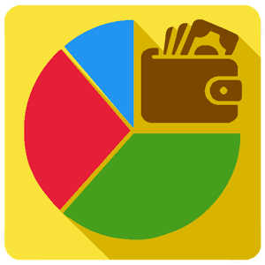

<h1 align="center">

</h1>

<h3 align="center">
Application to control financial consumption in a residence.
</h3>

## Overview

Go - House is fully developed in JavaScript and its entire ecosystem. Its main function is to help people who share housing, especially students, control their debts.

## Table of contents

- [Key features](#key-features)
- [Quick start](#quick-start)
- [Bugs and feature requests](#Bugs-and-feature-requests)
- [Contributing](#contributing)
- [Creators](#creators)
- [Thanks](#thanks)
- [Copyright](#copyright)

## Key features

- Division and control of debt payments.
- More practicality in the division of the tasks of the home.
- Nice performance for users.
- More reliability in residential transactions.

## Quick start

- instructions for use

## Bugs and feature requests

Have a bug or a feature request? Send pull request to us. If your problem or idea is not addressed yet, [please open a new issue](https://github.com/TMarinho99/house-nodejs/issues/new).

## Contributing

Any and all contributions are welcome, be considerate of your commits :)

Moreover, all HTML and CSS should conform to the Code Guide, maintained by [Thiago Marinho](https://github.com/TMarinho99).

## Creators

- https://github.com/tmarinho99

## Thanks

Thanks and enjoy this tool that we make available to you.

## Copyright

Code and documentation copyright the authors.

Enjoy 